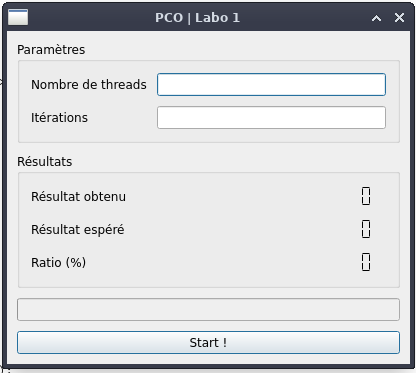
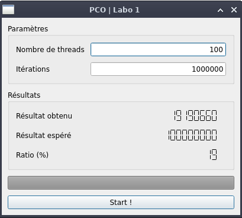
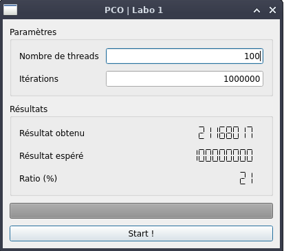
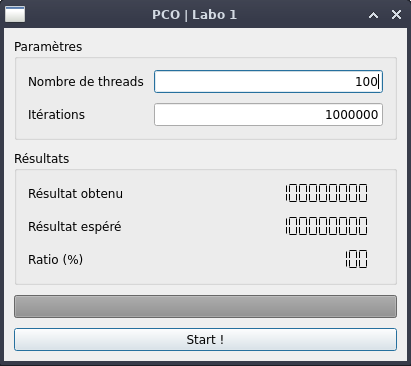
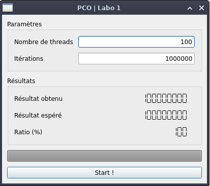
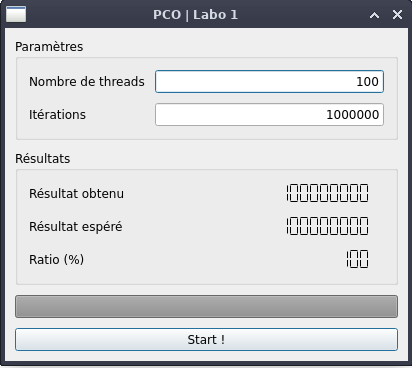

# Labo1: Prise en main des threads et observation de l’ordonnancement

Auteur: Timothée Van Hove


## Objectifs pédagogiques

- Se familiariser avec l’environnement de programmation.
- Réaliser son premier programme concurrent en C++.
- Observer l’influence de l’ordonnanceur.
- Tester les problèmes de concurrence.


## Introduction

Ce rapport se concentrera sur la partie `7 implémentation de compteur`. Dans cette partie nous devons comprendre les problèmes de "Data race",  où plusieurs threads accèdent à un emplacement mémoire simultanément.

## Logiciel fourni

Le logiciel fourni est une application QT qui fait apparaître une fenêtre permettant de choisir un nombre de thread et un nombre d'itérations.



Lorsque nous avons rempli les paramètres, en cliquant sur le bouton "Start !", le programme créé n threads et exécute du code fans une boucle de n itérations. Il affiche ensuite la valeur du compteur que nous avons obtenu et la valeur du compteur que nous aurions du obtenir.

voici un extrait des parties les plus intéressantes du code exécuté:

```c++
        /* Crée les threads, on ajoutant leur pointeur à la liste.
           Les threads sont immédiatement lancés par le constructeur. */
        for (long unsigned int i=0; i<nbThreads; i++)
        {
            PcoThread *currentThread = new PcoThread(runTask, nbIterations);
            threadList.push_back(std::unique_ptr<PcoThread>(currentThread));
        }

        /* Attends la fin de chaque thread et libère la mémoire associée.
         * Durant l'attente, l'application est bloquée.
         */
        for (long unsigned int i=0; i<nbThreads; i++)
        {
            threadList[i]->join();
        }
        /* Vide la liste de pointeurs de threads */
        threadList.clear();
```


et voici la fonction runTask:

```c++
void runTask(unsigned long nbIterations)
{
    long unsigned int i = 0;

    while (i < nbIterations)
    {
        counter++;
        i++;
    }
}
```


## Analyse du problème

Nous pouvons voir dans le programme exécuté que nous créons `n` threads dans une boucle de `n` itération. Chaque thread voulant incrémenter la même variable `counter` qui est globale dans le code.

Nous avons donc un problème de "data race" car l'incrémentation de la variable partagée `counter++` n'est pas atomique. L'incrémentation post fixée peut être décomposée comme suit:

- **Load**: Chargement de la valeur de `counter` dans un registre
- **Increment**: incrémente la valeur dans le registre
- **Store**: écrit la nouvelle valeur du registre dans la variable `counter`

Cet incrément est donc sujet à une data race dans certaines condition. Exemple:

Soient 2 threads, A et B et une variable `counter` valant 5:

- A **Load** `counter` dans un registre => registreA = 5
- B **Load** `counter`dans un autre registre => registreB = 5
- A **increment** `counter`dans registreA => regsitreA = 6
- B **increment** `counter` dans registreB => registreB = 6
- A **store** la valeur de registreA dans `counter` => counter = 6
- B **store** a valeur de registreB dans `counter` => counter = 6

Nous voyons dans l'exemple précédent que l'incrémentation simultanée par 2 threads mène à une valeur erronée, car à la place de valoir 7, `counter` vaut 6. L'incrémentation est donc une **section critique** tu code. Nous pouvons valider cette conclusion en observant les résultats du programme en lançant 100 threads pour 1'000'000 d’itérations:




## Amélioration du résultat

Comment pouvons nous améliorer le résultat? Il faudrait trouver un moyen de bloquer l'accès à la section critique tu code à un seul thread à la fois: une **exclusion mutuelle**. Pour ce faire nous allons implémenter un spin lock naif:

```c++
class NaiveSpinLock{
volatile bool locked = false;

public:
	void lock(){
	while(locked);
	locked = true;
	}
	
	void unlock(){
	locked = false;
	}
}
```

Ce lock est très simple: à l'appel de la fonction lock(), la variable `locked` est mise à `true` si elle veut `false`. Lorsqu'un autre thread appelle la fonction lock(), is sera bloqué dans une boucle while (spin) jusqu'à ce que le thread qui "tient le lock" ne remette la variable à `false`.


Utilisation du lock:

```c++
#include "mythread.h"
#include "naivespinlock.h"

static volatile long unsigned int counter;
static NaiveSpinLock nsLock;

void runTask(unsigned long nbIterations)
{
    long unsigned int i = 0;

    while (i < nbIterations)
    {
        nsLock.lock(); // Verouillage de l'accès
        ++counter;
        nsLock.unlock(); // Déverouillage de l'accès
        i++;
    }
}
```

Mais alors, es-ce que ça améliore notre résultat?



Pas vraiment...


#### Pourquoi ça ne marche pas?

Cette approche naïve est problématique pour les raisons suivantes :

**Race conditions**: Plusieurs threads peuvent simultanément constater que le lock n'est pas détenu et tenter de l'acquérir. Cela conduit à un comportement peu fiable et imprévisible.

**Absence de garanties d'ordonnancement de la mémoire** : En l'absence de barrières de mémoire appropriées ou d'opérations atomiques, il n'y a aucune garantie que les modifications apportées par un thread seront immédiatement visibles par un autre thread. Cela signifie qu'un thread peut penser que le verrou est libre même si un autre thread vient de l'acquérir.

Ce lock ne garanti donc pas une exclusion mutuelle correcte. **Mais alors, comment faire?**


#### Let's get atomic!

On doit utiliser des opération dites `atomiques`. Une opération atomique garanti que son exécution complète sera effectuée sans interruption.

Essayons de ré-implémenter notre spinLock avec des opérations atomiques:

`spinLock.h`

```c++
#include <atomic>

class SpinLock
{
public:
    void lock();
    void unlock();

private:
    std::atomic<bool> locked = {false};
};
```

`spinLock.cpp`

```c++
#include "spinlock.h"

void SpinLock::lock(){
    //Atomically exchange the value of locked with 'true'
    //if the previous value was 'false', the lock was free, and is now acquired
    //if the previous value was 'true', the lock is held, and we now spin (loop)
    while(locked.exchange(true, std::memory_order_acquire)){
        ;
    }
}

void SpinLock::unlock(){
    locked.store(false, std::memory_order_release);
}
```

`Utilisation`

```c++
#include "mythread.h"
#include "spinLock.h"

static volatile long unsigned int counter;
static  SpinLock sLock;

void runTask(unsigned long nbIterations)
{
    long unsigned int i = 0;

    while (i < nbIterations)
    {
        sLock.lock();
        ++counter;
        sLock.unlock();
        i++;
    }
}
```


Cette fois, le flag qui indique l'état du lock est de type `atomic<bool>`. Cela nous permet d'utiliser les opérations `exchange` et `store` qui sont aussi atomiques.

`atomic::exchange()`: Cette opération attribue une valeur à une variable atomique et retourne son ancienne valeur.

`atomic::store()`: Cette opération attribue une valeur à une variable atomique.

#### Un peu d'ordre!

Quand on exécute une opération atomique, celle-ci a une "cohérence séquentielle" garantie. Cette notion de cohérence est très importante dans le cas de processeurs multi-coeurs, car ces derniers on des caches séparés. Il faut donc assurer un ordre de lecture et d'écriture sur les variables atomiques. Les qualificateurs `memory_order_xxx` contrôlent l'ordre des lectures et écritures sur les variables atomiques.

`std::memory_order_acquire`: Les lectures dans le thread courant dépendant de l'opération se produiront après l'opération. En d'autres termes, une fois qu'une valeur est lue dans une variable atomique avec `memory_order_acquire`, on est assuré que chaque lecture ou écriture apparaissant avant l'opération atomique dans le code sera terminée et ne sera pas réordonnée pour se produire après elle.

`std::memory_order_release`: Les écritures dans le thread courant précédant l'opération seront achevées avant l'opération. Cela garantit qu'une fois qu'une valeur est stockée dans une variable atomique avec `memory_order_release`, toutes les écritures précédentes (dans l'ordre du programme) sont visibles pour les autres threads avant que le stockage atomique ne devienne visible.

#### Donc, ce spin-lock, ça marche bien?



Oui mais lent. Beaucoup, beaucoup trop lent! Pour effectuer les 1000000 boucles avec 100 threads, il a fallu plus de 3 minutes. Avec ce spin lock, tous les threads en attente gaspillent les ressources du CPU en faisant des boucles dans le vide, jusqu'à ce que celui qui a le lock termine son exécution. ce n'est donc pas optimal. 

**Bon, alors, y-a t'il une autre solution?** Oui! il faudrait trouver un moyen d'indiquer à l’ordonnanceur de préempter l’exécution d'un thread si celui-ci ne détient pas le lock.


#### Chuchotons à l'oreille de l’ordonnanceur!

Pour indiquer à l'ordonnanceur que l'exécution peut être préemptée, nous allons utiliser `std::this_thread::yield();`

`yieldLock.h`

```c++
#include <atomic>
#include <thread>

class YieldLock
{
public:
    
    /**
     * @brief Essentially the same implementation as the SpinLock::lock()
     * @details The only difference id that instead of spinning, the lock yields its time slice back to the scheduler
     */
    void lock();
    
    void unlock();

private:
    std::atomic<bool> locked = {false};
};
```


`yieldLock.cpp`

```c++
#include "yieldlock.h"

void YieldLock::lock(){
    while(locked.exchange(true, std::memory_order_acquire)){
        // Here we hint the scheduler that we are waiting for the lock
        // and that this thread can be preempted to allow other threads to run
        // so the time allowed by the scheduler is not waisted just spinning.
        std::this_thread::yield();
    }
}

void YieldLock::unlock(){
    locked.store(false, std::memory_order_release);
}

```

`Utilisation`

```c++
#include "mythread.h"
#include "yieldlock.h"

static volatile long unsigned int counter;
static  YieldLock yLock;

void runTask(unsigned long nbIterations)
{
    long unsigned int i = 0;

    while (i < nbIterations)
    {
        yLock.lock();
        ++counter;
        yLock.unlock();
        i++;
    }
}
```


#### Et ce YieldLock, ça marche mieux?

Oui! beaucoup mieux!



Il a fallu entre 2 et 3 secondes pour exécuter le même programme qu'avec le spinLock, toujours avec une exclusion mutuelle fonctionnelle.

**Oui, mais c'est chiant de devoir créer ces locks à chaque fois!** Oui c'est chiant, on peut faire des erreurs et c'est pas forcément optimisé.


#### std::mutex à la rescousse!

Heureusement la stdlib nous fournit déjà tout ce dont nous avons besoin pour gérer l'exclusion mutuelle: les `mutex`.

`utilisation`:

```c++
#include "mythread.h"
#include <mutex>

static volatile long unsigned int counter;
static  std::mutex mutex;

void runTask(unsigned long nbIterations)
{
    long unsigned int i = 0;

    while (i < nbIterations)
    {
        mutex.lock();
        ++counter;
        mutex.unlock();
        i++;
    }
}
```


#### Et ce mutex, ça marche mieux que le YieldLock?

En tout cas ça marche, mais tout dépend de ce que "mieux" signifie.



L'avantage avec un std::mutex, c'est qu'on a pas besoin de savoir comment il est implémenté. I fonctionne, peu importe la plateforme. De plus, comme il fait partie de la stdlib, il est robuste.

Par contre, dans notre cas, le mutex est plus lent que le YieldLock. Les mutex sont adaptatifs. Cela veut dire qu'au lieu de "yield" son temps d’exécution directement à l’ordonnanceur, il va attentre un certain temps (basé sur des algorithmes). Cela permet (entre autres) de réduire le nombre de "Context switch", qui est coûteux en terme de performance.

Lorsqu'un processeur exécute un thread, il utilise des registres pour les calculs, il dispose d'un compteur de programme (l'adresse de l'instruction suivante), et il maintient d'autres informations d'état comme le pointeur de pile, etc. Imaginons maintenant que, pour une raison quelconque, ce thread doive être mis en pause et qu'un autre thread doive s'exécuter sur le même cœur CPU. Cette mise en pause du thread en cours d'exécution, l'enregistrement de son contexte (les informations d'état susmentionnées), puis le chargement du contexte d'un autre thread à exécuter est ce que nous appelons un "context switch".

**Bon, alors c'est plié ce labo, on peut le rendre!** Oui, mais avant ça, j'aimerais encore tester un autre type de lock.


#### (Extra) On prend un ticket et on fait la queue!

Dans certains use case il est important de garder l'ordre dans lequel les threads veulent accéder au lock. Pour ça on va implémenter un TicketLock. Un ticket lock est une sorte de yieldLock qui utilise un algorithme de file d'attente équitable pour s'assurer que les threads acquièrent le verrou dans l'ordre où ils l'ont demandé. Cela permet d'éviter la "famine" et de garantir **l'équité**, au prix d'un peu plus de complexité.

`ticketLock.h`

```c++
#include <atomic>
#include <thread>
#include "stdlib.h"

class TicketLock
{
public:
    void lock();
    void unlock();

private:
    // ticket number of the thread that is currently allowed to hold the lock
    std::atomic<size_t> currentTicket = {0};

    // ticket number thet the next thread trying to get the lock will take
    std::atomic<size_t> nextTicket = {0};
};
```


`ticketLock.cpp`

```c++
#include "ticketLock.h"

void TicketLock::lock(){
    size_t ticket = nextTicket.fetch_add(1, std::memory_order_relaxed);
    while(currentTicket.load(std::memory_order_acquire)!= ticket){
        // Here we hint the scheduler that we are waiting for the lock
        // and that this thread can be preempted to allow other threads to run
        // so the time allowed by the scheduler is not waisted just spinning.
        std::this_thread::yield();
    }
}

void TicketLock::unlock(){
    currentTicket.fetch_add(1, std::memory_order_release);
}
```


`utilisation`

```
#include "mythread.h"
#include "ticketLock.h"

static volatile long unsigned int counter;
static  TicketLock tLock;

void runTask(unsigned long nbIterations)
{
    long unsigned int i = 0;

    while (i < nbIterations)
    {
        tLock.lock();
        ++counter;
        tLock.unlock();
        i++;
    }
}
```

#### Et ce lock communiste, ça marche?

Oui ça marche, mais c'est aussi (voire plus) long que le simple spinlock. Il y a probablement des moyens de garantir l'équité, mais c'est ici que s’arrête mes recherches.


## Tests de performance: mutex vs YieldLock vs SpinLock

Pour faire ces tests, j'ai simplement calculé le temps d'execution de la boucle for avec un `std::chrono`:

```c++
        // Début du chrono
		auto start = std::chrono::high_resolution_clock::now();

        for (long unsigned int i=0; i<nbThreads; i++)
        {
            PcoThread *currentThread = new PcoThread(runTask, nbIterations);
            threadList.push_back(std::unique_ptr<PcoThread>(currentThread));
        }

        for (long unsigned int i=0; i<nbThreads; i++)
        {
            threadList[i]->join();
        }

		// Fin du chrono
        auto end = std::chrono::high_resolution_clock::now();
        threadList.clear();

		// Affichage des résultats
        std::cout<< "Elapsed time:" << std::chrono::duration<double, std::milli>(end-start).count() << "ms" << std::endl;
```


Test pour 100 threads qui exécutent la fonction `runTask` dans une boucle de 1'000'000 itérations, sur une machine virtuelle avec 2 cœurs.

without lock: `Elapsed time:226.356ms`

NaiveSpinLock: `Elapsed time:2181.56ms`

SpinLock: `Elapsed time:391156ms` = `6.52 minutes`

YieldLock: `Elapsed time:1872.34ms`

std::mutex: `Elapsed time:4528.44ms`

TicketLock: trop long et trop peu de patience pour récupérer le résultat...

Ces résultats ne représentent pas la réalité de tous les cas d'utilisation. Ils dépendent de la machine sur laquelle ils ont été exécutes. Pour avoir une idée plus précise de la performance des ces mécanismes, il faudrait faire des tests avec un nombre différent de threads, d'itération et de nombre de cœurs sur la machine. Pour être encore plus complet, nous devrions aussi exécuter ces tests en variant les options d'optimisation du compilateur.


## Conclusion

Pour garantir un accès exclusif d'un thread à une zone critique du code, nous devons mettre en place un mécanisme d'exclusion mutuelle (mutex). Pour ce faire, la librairie standard nous offre la possibilité d'utiliser std::mutex. Comme nous l'avons vu dans les tests de performance, le std::mutex n'est pas forcément le plus performant, cependant, il nous évite de devoir concevoir un lock avec de potentielles erreurs.
